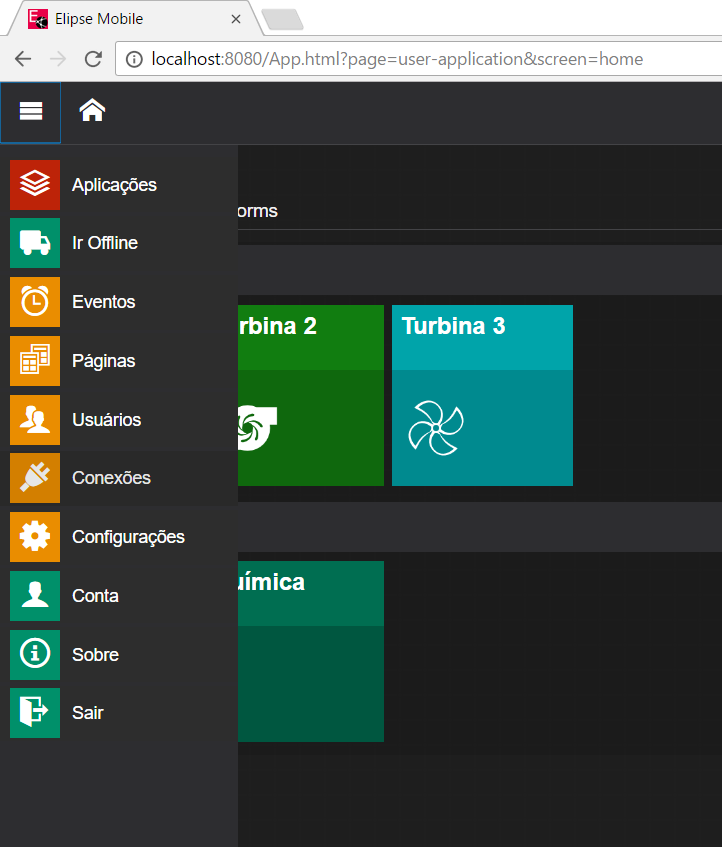
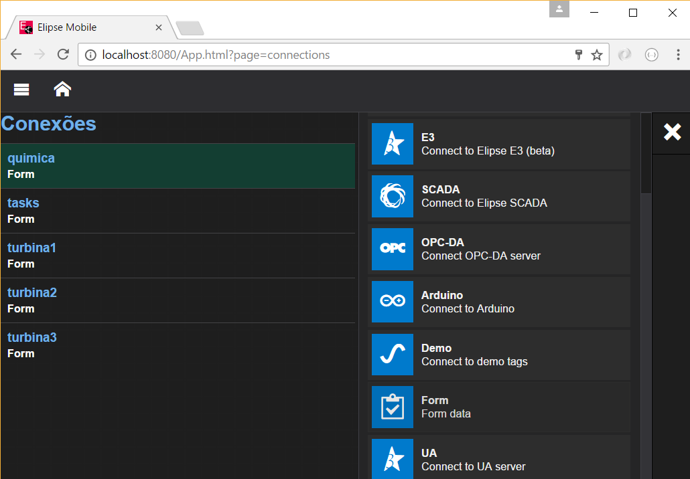

# Elipse Mobile Forms

##Introdução
O Elipse Mobile forms permite a criação de formulários para serem preenchidos online ou offline.
Estes formulários podem ser usados como pequenos bancos de dados e também para fazer coletas em campo.

##Conceitos

Cada form do Elipse Mobile representa uma tabela.

Para criar um form vá em _Menu -> Conexões -> "+" -> Form_

Entre com o nome do formulário:

###Tipos de campos

###Fase de revisão 
[X] Incluir fase de revisão
Esta opção faz com que exista uma fase adicional no fluxo do formário.

###Permissões
Administradores podem: 
 - Criar uma nova entrada (registro) no formulário
 - Podem deletar registros
 - Editar campos reservados para Administradores
 - Aprovar/revisar respostas de formulários caso esta opção seja usada
 - As demais opções de usuários

Usuários podem:
 - Responder formulários
 - Atribuir (levar para edição) um formulário para si mesmo
 - Desistir de preencher um formulário atruibuido para si mesmo
 
##Fluxo de edição do Form

Ao ser criada 
